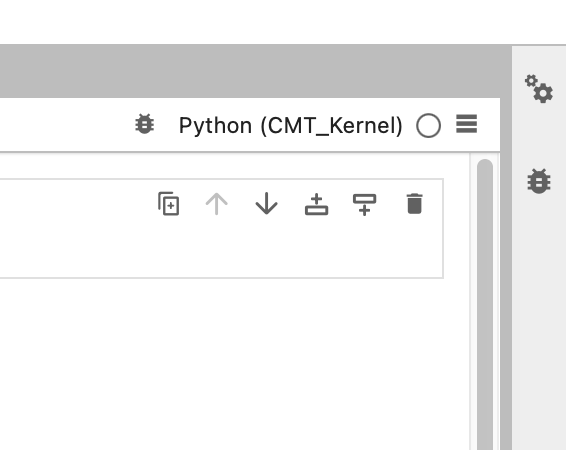
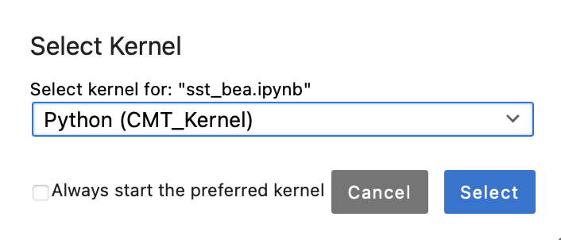

# Hot-Spot Analysis and data visualization with `Copernicus Marine Toolbox`

- this repository was mainly created for `Archipelagos` interns to maintain data harvesting from `Copernicus Ocean Products` for marine research purposes
- this is a 'from scratch guide' starting from anaconda installation and copernicus API setup to more sophisticated data querying and visualization

## Requirements
### Step 0:
- a working package/file/environment manager like anaconda/miniconda or micromamba with a Python > 3 installation:
  - refer to the Archipelagos GIS Google Drive (contact Tim Grandjan for access [here](mailto:t.grandjean@archipelago.gr)) or get instructions directly from the providers:
    - [here](https://www.anaconda.com/download) for anaconda/miniconda
    - [here](https://mamba.readthedocs.io/en/latest/installation/micromamba-installation.html) for micromamba

- an Interactive Development Environment (IDE) or a Notebook-based Interactive Computing Environment:
  - this repository was built using Jupyter lab (read more details [here](https://jupyter.org))
  - after sucessfull conda installation follow the next steps to get your instance
  - it is highly recommended to install Juypter lab in a seperate environment and link other environment Kernels to this one instance
 
    ```bash
    # Create and Activate a jupyter Environment
    conda create -n jupyter python=3.9 jupyterlab ipykernel -y
    conda activate jupyter
    ```
    
    ```bash
    # Install Juypter
    conda install -c conda-forge jupyterlab
    ```

### Step 1: Establish connection to Copernicus Server

A video tuturial can be found [here](https://vimeo.com/943705586) and in more detailed written form [here](https://help.marine.copernicus.eu/en/articles/7970514-copernicus-marine-toolbox-installation)

#### **1. Install the Toolbox from the conda-forge channel**
```bash
mamba create --name copernicusmarine conda-forge::copernicusmarine --yes
```

#### **2. Activate copernicusmarine environment**
```bash
conda activate copernicusmarine
```

#### **3. Verify installation**
```bash
conda list  # Lists installed packages
```

#### **4. Install a ipykernel**
```bash
# Inside the copernicusmarine environment, install the ipykernel package
conda install -c conda-forge ipykernel -y
```

#### **5. Register this environment as a Jupyter Kernel**
```bash
# This registers the copernicusmarine environment inside Jupyter
python -m ipykernel install --user --name copernicusmarine --display-name "CMT_Kernel"
```

### Step 2: Install necessary libraries 
```bash
conda env update --name copernicusmarine --file requirements.yml # find requirments.yml in this repository
```

### Step 3: Start the installation

#### **1. Activate juypter environment**
```bash
conda activate jupyter # navigate to your terminal/shell 
```

#### **2. Start Juypter lab**
```bash
jupyter lab # this will automatically open a new browser window and host the Jupter IDE
```

#### **3. Select the `Copernicus Marine Toolbox` Kernel in the right upper corner of your browser window inside the IDE:**

      


## Usage

The  `Copernicus Marine Toolbox` sends a get_feature request through a Python API to the Copernicus Server. The query can be customized by passing a dictionary (`input_dict` compare code snippet). It consists of the following components:
  - `dataset_id` defines the product to be queried, by default set to sea surface temperature
  - `variables` defines a list of variables selected from the product (identifer = dataset_id), by default set to adjusted sea surface temperature

```python
input_dict = {
    "dataset_id": "SST_MED_SST_L3S_NRT_OBSERVATIONS_010_012_b", 
    "variables": ["adjusted_sea_surface_temperature"], 
    "minimum_longitude": 19.22659983450641, 
    "maximum_longitude": 28.439441984120553, 
    "minimum_latitude": 34.62160284496615, 
    "maximum_latitude": 40.9634662781889, 
    "start_datetime": "2023-12-01T00:00:00", 
    "end_datetime": "2024-02-28T00:00:00", }
```

```python
unit = "°C"

variable_abreviation = "sst"
```

## Output

## Relevant References

### Copernicus Marine Ocean Products

- access the Copernicus Marine Data Storage and find data compatible with this script [here](https://data.marine.copernicus.eu/products)
- explore quality of Copernicus Marine Data [here](https://pqd.mercator-ocean.fr/?pk_vid=161106812679b150)

### Complementary 

- read about xarray [here](https://docs.xarray.dev/en/stable/getting-started-guide/installing.html)
- watch a video about Hot-Spot Anylsis [here](https://www.youtube.com/watch?v=sjLyJW95fHM)
- learn about geospatial Python [here](https://geog-312.gishub.org)
